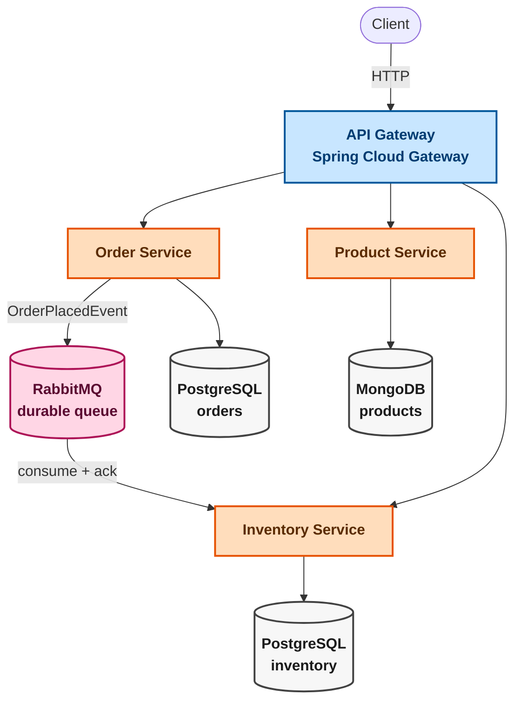

# Nexus — Event-Driven Microservices Backend

A containerized backend demonstrating microservice decoupling, asynchronous order processing, polyglot persistence, and API gateway routing.

**Stack:** Java 21 · Spring Boot 4 · RabbitMQ · PostgreSQL · MongoDB · Docker Compose

Each service owns its datastore and communicates through events where appropriate, with a single API gateway as the entry point. This is a working MVP, not a production platform.

---

## Architecture

| Service               | Responsibility                               | Datastore  | Port |
| --------------------- | -------------------------------------------- | ---------- | ---- |
| **API Gateway**       | Routes client requests                       | —          | 8080 |
| **Order Service**     | Creates orders, publishes `OrderPlacedEvent` | PostgreSQL | 8081 |
| **Product Service**   | Product catalog CRUD                         | MongoDB    | 8082 |
| **Inventory Service** | Consumes order events, decrements stock      | PostgreSQL | 8083 |

Infrastructure: RabbitMQ, PostgreSQL, and MongoDB, managed through `docker-compose.yml`.

## Get Started

### Prerequisites

* Docker + Docker Compose

No local Java or Maven installation is required.

### 1. Start the stack

```bash
docker compose up --build -d
```

Check service status:

```bash
docker compose ps
```

Wait until all services are `healthy`.

### 2. Run the order flow

All requests go through `localhost:8080`.

**Create a product:**

```bash
curl -X POST http://localhost:8080/api/products \
  -H "Content-Type: application/json" \
  -d '{"name":"Mechanical Keyboard","description":"Hot-swappable 75%","price":89.99}'
```

Copy the returned `id`.

**Seed inventory:**

```bash
curl -X POST http://localhost:8080/api/inventory \
  -H "Content-Type: application/json" \
  -d '{"productId":"<product-id>","stock":50}'
```

**Place an order:**

```bash
curl -X POST http://localhost:8080/api/orders \
  -H "Content-Type: application/json" \
  -d '{"productId":"<product-id>","quantity":5}'
```

The order returns immediately with `status: CREATED`. Inventory is updated asynchronously.

After a second:

```bash
# Order
curl http://localhost:8080/api/orders/<order-id>

# Inventory: should now show 45
curl http://localhost:8080/api/inventory/<product-id>
```

The flow is:

`Order → OrderPlacedEvent → RabbitMQ → Inventory Service → stock -5`

Watch the event flow in the logs:

```bash
docker compose logs -f order-service inventory-service
```

**Validation:**

```bash
curl -X POST http://localhost:8080/api/orders \
  -H "Content-Type: application/json" \
  -d '{"productId":"","quantity":-1}'
```

Returns `400` with field-level validation errors.

### 3. Verify event durability

Stop Inventory Service:

```bash
docker compose stop inventory-service
```

Place an order. It still returns `201` because Order Service does not depend on Inventory Service being available.

Check RabbitMQ at `http://localhost:15672` (`guest` / `guest`) → **Queues** → `inventory.order-placed.queue`.

The event remains queued until Inventory Service returns:

```bash
docker compose start inventory-service
```

The queue drains and inventory is updated.

### Teardown

```bash
docker compose down        # stop containers, keep volumes
docker compose down -v     # stop containers and delete volumes
```

## Order Flow

1. Client creates a product and seeds inventory.
2. Order Service validates and persists the order.
3. Order Service publishes `OrderPlacedEvent` to RabbitMQ.
4. Inventory Service consumes the event and atomically decrements stock.
5. If Inventory Service is unavailable, the event remains in the durable queue until it recovers.

Inventory updates use a conditional database update:

```sql
UPDATE ... WHERE stock >= ?
```

This prevents lost updates when orders are processed concurrently.

### Eventual Consistency

Order creation does **not** guarantee stock availability. Order Service does not synchronously check Inventory Service.

If stock is insufficient or the product is missing from inventory, Inventory Service records the business-rule outcome without failing the order.

## API

```text
POST /api/products          { name, description, price }
GET  /api/products
GET  /api/products/{id}

POST /api/inventory         { productId, stock }
GET  /api/inventory/{productId}

POST /api/orders            { productId, quantity }
GET  /api/orders/{id}
```

Write endpoints validate input and return:

* `400` — invalid payload
* `404` — resource not found
* `409` — conflicting state

Each service exposes `/actuator/health`.

## Verification

The following scenarios have been tested against the running containers:

* **Happy path:** product → inventory → order → event → stock decrement
* **Durability:** orders remain queued while Inventory Service is down and are processed after restart
* **Validation:** invalid quantity and blank `productId` return `400`
* **Routing:** unmapped gateway routes return `404`
* **Persistence:** data survives `docker compose down` followed by `up`

## Scope

This is an MVP. The following are intentionally out of scope:

* Authentication/authorization, User Service, JWT/OAuth2
* Kubernetes, service discovery, multi-region deployment, autoscaling
* Centralized logging, Prometheus/Grafana, distributed tracing
* Dead-letter queues, circuit breakers, and broader resilience patterns
* CQRS and event sourcing
* Redis

Inventory Service retries failed messages before rejecting them, but there is currently no DLQ.

## Future Work

* Idempotent inventory updates for RabbitMQ's at-least-once delivery
* Dead-letter queue
* Prometheus metrics and Grafana dashboard
* Testcontainers integration tests
* JWT authentication with a User Service
* Kubernetes manifests / Helm chart

## System Diagram


